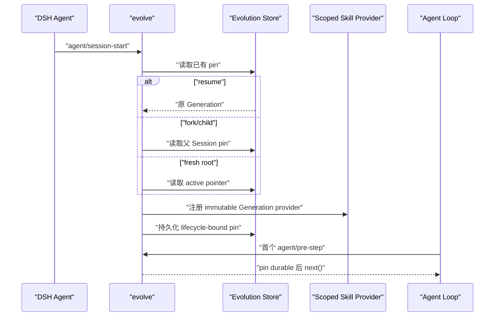

# EvoForge 可证明自进化设计

> 状态：设计已获授权；P0A.1 safety tracer 已实现，完整 P0A evaluator 尚未完成
> 更新日期：2026-08-15
> 适用范围：单机常驻 DSH、Skill 指令型能力、软件开发交付试验场

## 1. 结论

不存在能够保证对所有未来任务都“越来越聪明”的完美自进化。可实现且值得开源的目标是：

> Agent 从真实任务结果中提出一个小改动，在不影响当前会话的前提下，用相同任务和保留样本证明它优于当前版本；证据充分时只对未来会话原子晋升，证据模糊时异步等待复核，出现回归时能够立即回滚。

因此，自进化不是“模型可以改自己的文件”，而是一个受约束的能力发布系统。它追求的不是修改次数，而是以下结果：

- 用户纠正和返工逐步减少；
- 通过仓库真实检查的交付逐步增加；
- 每次晋升都能解释“改了什么、为什么改、凭什么更好”；
- 当前会话永不被后台学习改变；
- 模糊候选不阻塞正常工作；
- 每个版本有精确内容哈希和回滚目标；
- DSH 的模型可见前缀和 KV Cache 优势不被破坏。

## 2. 首个用户问题

P0 只解决一个窄而真实的问题：

> 同一个用户或团队反复使用 DSH 做软件开发时，Agent 会重复犯相似的流程错误，例如漏读仓库规范、修改后未重跑检查、错误选择工具、重复产生已被纠正的交付格式。系统能否把这些真实纠正沉淀为更好的 Skill，并证明新 Skill 确实降低了同类返工？

软件开发是首个试验场，不是因为产品只服务程序员，而是因为它有较强的客观结果：测试、lint、类型检查、diff、审查意见、Goal 结果、人工返工、耗时、token 与 cache-read。

个人助理、内容、消息和日程以后可以提供新的 Learning Signal 与 Trial case，但不能让 P0 预建通用自治平台。

第一个交付物不是 Generation Binder，而是离线 `dsh-evolve shadow <skill-dir>`。它只读 active Skill，在一个真实 evaluator 上证明候选评价有用；证明失败就停止，不用发布基础设施掩盖价值缺口。

## 3. “完美”的可验证定义

本项目把“完美”改写为六个长期不变量：

1. **Evidence before mutation**：反思只生成假设，真实结果决定晋升。
2. **Inactive by default**：候选永远先处于不生效状态。
3. **Session immutability**：一个 Session 从开始到结束固定使用同一 Capability Generation。
4. **Deterministic gates first**：安全、权限、测试、格式、范围和缓存门槛先于模型判断。
5. **Reversible release**：晋升只切换一个不可变版本指针，不原地修改当前版本。
6. **Foreground independence**：观察、试验、复核和等待审批都不能阻塞产生信号的原会话。

这六项可以被测试。无法被测试的“总体更聪明”不进入产品承诺。

## 4. 产品形态：一个深模块，不是一组内部平台

最终产品只发布一个可选插件；P0A 先以仓库内离线 Shadow 命令验证价值，不承诺为稳定公共接口：

```text
dsh-evolve
  人类界面：/evolve status | review | promote | rollback | pause
  模型工具：无
  常驻提示词：无
```

插件内部可以分文件组织，但不把每个步骤发布成浅插件：

```text
Observer
  → Candidate Lab
  → Trial Runner
  → Decision
  → Release
  → Monitor

Generation Binder
  └─ 为每个 Session 固定一个不可变 Skill Generation

Evolution Store
  └─ 保存紧凑信号、候选状态、版本清单和 Session pin
```

只有两个独立用户结果才值得形成第二个发布插件：

- `Evolve`：让受管 Skill 可证明地进化；
- `Software Delivery`：把原生 Goal 交付为隔离、验证过的 commit 或 Draft PR，并提供客观结果。

软件交付 Pack 对不启用自进化的用户也有独立价值，因此它通过 Feature Extension 检验。Observer、Trial Runner、Promoter 等只是 `evolve` 的内部实现，不单独发布。

## 5. DSH 接缝

| 需要 | 复用的 DSH 能力 | 用法 |
|---|---|---|
| 人类控制 | `ctx.commands` | 注册一个 `/evolve` command；不进入模型工具表面 |
| Skill 供应 | `ctx.skills.registerProvider()` | 在 Agent scope 注册固定 Generation 的 provider |
| Session 生命周期 | `agent/session-start`、`agent/pre-step` | 选择 Generation，并在首个模型步骤前等待 sidecar pin 落盘 |
| 真实过程事实 | `session/event`、`goal/changed` | 记录最小 Learning Signal 引用，不复制完整 transcript |
| 人工反馈 | `ctx.messageFeedback` 与 `domain/changed` | 读取已持久化的正负反馈和 note |
| 持久小状态 | `ctx.storageDomain` | Evolution sidecar；写入先 durable 后改变内存 |
| 后台执行 | `ctx.jobs` | 执行当前进程内候选和 Trial；Job 本身不是 durable authority |
| 重启恢复 | Evolution Store 扫描 | 把未终结状态重新提交给 Jobs |
| 隔离执行 | DSH FS、Shell、Sandbox | 创建候选 worktree 和成对 Trial 环境 |
| 会话事实读取 | Session Persistence / Query | 只在授权的候选生成或评测中按引用读取需要的片段 |
| 成本和缓存 | Token Meter、LLM usage | 记录 token、cache-read、耗时和完整 composition 指纹 |
| 权限 | Approval、Permission Preset | 可执行变化和 Protected Action 继续走原生权限管线 |

DSH 的 Skill Registry 本身支持分层 Provider、Agent scope 和 lifecycle disposer：[Skill Registry](https://github.com/deepseek-ai/deepseek-harness/blob/47f943859bef60e4160492346772ded9b24f765a/packages/skill/skill/src/index.ts#L1)。Skill body 不被 registry 缓存，每次 `get()` 重新读取，因此 P0 不能让 Provider 指向一个会原地变化的目录；必须让它读取 immutable Generation。

DSH 的 Agent 创建流程会在首个 prompt assembly 前完成 scoped setup，并提供 `agent/session-start` 与可等待的 `agent/pre-step`：[Agent lifecycle](https://github.com/deepseek-ai/deepseek-harness/blob/47f943859bef60e4160492346772ded9b24f765a/packages/core/agent/src/index.ts#L105)。Storage Domain 的写入语义是“先持久化，再改变权威内存，再发事件”，适合作为 sidecar：[Storage Domain](https://github.com/deepseek-ai/deepseek-harness/blob/47f943859bef60e4160492346772ded9b24f765a/packages/storage/storage-domain/src/domain.ts#L1)。

## 6. 为什么不用 Session 自定义事件保存 Generation

一个直觉方案是在 Session 日志追加 `evolution/generation-pin`。P0 拒绝这个方案：

- DSH 未知且非 ignorable 的 Session event 会使没有安装插件的旧运行时拒绝恢复；
- 插件卸载后，原生 DSH 会话仍应能工作；
- Generation pin 不参与模型历史重建，属于插件 sidecar，而不是 Session 事实。

因此 Generation pin 存在 Evolution Store，使用 `sessionId + createdAt + cwd` 绑定准确 Session 生命周期，沿用 Message Feedback 防止同名 Session 重建后串数据的思路：[Message Feedback identity](https://github.com/deepseek-ai/deepseek-harness/blob/47f943859bef60e4160492346772ded9b24f765a/packages/feedback/message-feedback/src/spec.ts#L42)。

这使插件满足可卸载性：移除 `evolve` 以后，DSH Session 日志没有私有必需事件，只是不再加载 evolved Skill overlay。

## 7. Capability Generation

Capability Generation 是一个不可变清单：

```ts
interface Generation {
  id: string                 // 内容派生 id
  parentId?: string
  createdAt: number
  artifacts: Array<{
    kind: 'skill'
    name: string
    gitCommit: string
    treeHash: string
  }>
  evaluatorVersion: string
  policyVersion: string
}
```

关键语义：

- Generation 不是复制整份 Skill 内容的数据库；Git commit/tree 是内容事实源；
- Evolution Store 只保存清单、索引和状态；
- active pointer 指向一个已经完整写入且校验过的 Generation；
- 晋升只改变 active pointer；
- 回滚只把 active pointer 指回祖先 Generation；
- 已有 Session 的 sidecar pin 永远不跟随 active pointer；
- 新根 Session 使用晋升时的 active pointer；
- fork、continuation child 或 subagent 优先继承父 Session 的 Generation，以保持派生历史的能力语义一致。

## 8. Session Generation Binder

每个 Session 的固定过程：



若 pin 写入失败：

1. 在首个模型步骤前卸载 evolved provider；
2. 该 Session 继续使用原生 Skill，不阻塞正常 DSH 会话；
3. 记录可诊断错误；
4. 本 Session 后续不再动态启用 evolved provider，避免模型工具目录中途变化。

若恢复时 pin 指向的 Git tree 丢失或损坏，也不能静默改用最新 Generation；应禁用本 Session 的 evolved overlay 并报告完整性错误。

## 9. Learning Signal

Learning Signal 是“值得调查的事实”，不是“应当写入 Skill 的结论”：

```ts
interface LearningSignal {
  id: string
  kind:
    | 'explicit-correction'
    | 'message-feedback'
    | 'verification-result'
    | 'goal-outcome'
    | 'human-rework'
    | 'cost-regression'
  scope: {
    user?: string
    project?: string
    skill?: string
  }
  source: {
    sessionId?: string
    sessionCreatedAt?: number
    eventSeq?: number
    messageId?: string
    artifactRef?: string
  }
  fingerprint: string
  observedAt: number
}
```

约束：

- 默认不复制完整 prompt、transcript、代码或秘密；
- fingerprint 只用于去重和聚类，不能作为训练事实；
- 单次模型反思、Skill 使用次数、工具调用次数、模型 confidence 和 recency 不能单独触发晋升；
- 一条明确用户纠正可以生成候选，但仍必须通过 Trial；
- 非明确反馈需要同类信号跨至少两个独立 Session 重复，才值得花模型预算生成候选；
- Project signal 默认只能改进 project-scoped Skill；跨至少两个项目证明通用后才能提议上移到 user/global scope。

## 10. Candidate

候选永远是 inactive Git commit，并包含一个可证伪主张：

```ts
interface Candidate {
  id: string
  artifact: { kind: 'skill'; name: string }
  baseGenerationId: string
  commit: string
  signalIds: string[]
  claim: {
    expectedImprovement: string
    primaryMetric: string
    minimumMargin: number
    forbiddenRegressions: string[]
  }
  cases: {
    reproduction: string[]
    retained: string[]
  }
  status:
    | 'proposing'
    | 'ready'
    | 'testing'
    | 'review'
    | 'rejected'
    | 'promoted'
    | 'rolled-back'
}
```

候选生成规则：

- 在独立 worktree 中修改；
- 只能修改显式 owned 的 Skill；
- 不修改已安装、bundled、组织共享或第三方 Skill；
- 不直接修改 active branch 或 active Generation；
- 优先替换、澄清或删除错误指令，不鼓励无止境追加文本；
- 每个候选只解决一个相对独立的 claim；
- 生成失败或超预算不会影响原会话。

候选搜索不是本插件的独特价值。P0A 先使用最小 patch proposer；若简单搜索无法覆盖真实失败，再以内置私有适配调用 GEPA。只有出现第二个真实 optimizer 后才发布公共 optimizer 接口。

## 11. Paired Trial

数据严格分为三层：

- `search`：允许 proposer/optimizer 使用，用于生成和迭代候选；
- `selection`：用于候选比较，可以重复使用，但不能被写入候选提示；
- `final-test`：一次搜索结束前保持未开放，只用于决定本轮结果；反复使用后必须降级并补充新 case。

Baseline 和 Candidate 使用：

- 相同任务输入；
- 相同仓库基线 commit；
- 相同模型 route、工具集合、权限和预算；
- 分离且干净的 worktree；
- 相同的 deterministic checks；
- 独立 Session；
- 相同完整 composition，唯一允许的能力差异是被测试 Skill 的内容版本。

评测顺序不可被模型改写：

1. 权限与 Protected Action；
2. 候选 diff 范围和 Skill 格式；
3. 仓库 tests、lint、typecheck、build 或用户验收命令；
4. 触发问题是否复现并被修复；
5. retained cases 是否回归；
6. 人工纠正或返工是否减少；
7. latency、token、cache-read 和 Skill 长度；
8. 只有剩余主观差异才允许 blind model judge。

模型 judge：

- 看不到哪个输出来自 Candidate；
- 只能补充主观评价；
- 不能覆盖安全、权限、测试和缓存 hard gate；
- 其判断单独存在时永远不能自动晋升。

Trial 的随机模型输出无法保证逐 token 重现。可重现的是：固定输入、版本、模型配置、工具 composition、检查命令、原始输出和评测程序；给定已经保存的 Trial 结果，Decision 必须是纯函数并稳定重放。

确定性 case 可以单次判定；随机 case 必须使用预声明的最小复跑数、相同 paired 配置和明确的 tie policy。模型 route、provider、模型版本或 evaluator 变化会开启新的 evaluation epoch，不能直接继承旧分数。证据不足只能 `review` 或 `reject`。

## 12. 简单的晋升政策

P0 不设计通用评分语言，只保留三种结果：

| 条件 | 结果 |
|---|---|
| 任一 hard gate 失败；Candidate 没有修复 claim；retained case 回归 | `reject` |
| 只有主观收益；样本不足；指标互有胜负；scope 发生扩大 | `review` |
| 所有 hard gate 通过，达到预声明 margin，无 retained regression，rollback rehearsal 成功 | `promote` 或 shadow recommendation |

自动晋升还必须同时满足：

- 当前模式是 `auto-instructions`，而不是默认 `shadow`；
- 只改变 Markdown 指令和同目录非执行型 reference/template；
- 不增加脚本、binary、工具、权限、秘密、网络目标或外部效果；
- 不提高 Protected Action、秘密访问、网络目标或不可逆动作的请求概率；不能仅凭 `.md` 扩展名推定低风险；
- 至少满足以下一个清晰证据条件：
  - 修复一个 baseline 可重复失败、Candidate 稳定通过的 deterministic case；或
  - 在至少两个独立任务上消除同类明确纠正；
- 全部 retained cases 通过；
- 完整 composition 的缓存回归在预算内；
- 候选 Generation 已完成一次切换与回滚演练。

可执行脚本、插件源码、工具 Schema、权限、部署行为和外部动作只能生成 commit 或 Draft PR，不能由 P0 自动激活。

## 13. Release 与 rollback

Promotion 是两阶段的：

1. 先写入并校验 immutable Generation 记录和 Git tree；
2. 再用 Storage Domain 的单个 global 写入切换 active pointer。

崩溃语义：

- 指针切换前崩溃：Candidate 仍 inactive；
- 指针切换后崩溃：新 Session 使用新 Generation；
- Candidate 状态还没写成 `promoted` 时，恢复器以 active pointer 为准补齐派生状态；
- active pointer 永远不能指向不存在或未校验的 Generation。

Rollback 使用相同机制，把 active pointer 指回已验证的 parent。已有 Session 不切换；回滚只影响之后创建或恢复时尚未 pin 的新 Session。它只能恢复能力版本，不能撤销已经发送的消息、创建的日程、付费、部署或数据修改。

## 14. Post-promotion monitoring

晋升不是终点。Monitor 只比较与原 claim 相关的后续信号：

- 同一个 deterministic failure 再次出现：先在隔离环境补跑 parent/candidate；只有 parent 通过而 candidate 失败时自动回滚；
- Protected Action、权限或缓存 hard gate 回归：立即自动回滚；
- 主指标明显下降但无法建立反事实：进入 review，不自动来回切换；
- 没有足够匹配任务：保持当前版本，不把“没有投诉”误判为成功。

每个 Generation 只允许一次自动回滚，避免两个版本之间振荡。再次晋升必须产生新 Candidate 和新 Trial。

## 15. 单机常驻与崩溃恢复

进程拉起交给 systemd、launchd 或用户已有的 DSH 启动方式，插件不实现第二个 daemon manager。

Evolution Store 是 durable authority；`ctx.jobs` 只是当前进程执行器。启动时扫描：

| 状态 | 恢复动作 |
|---|---|
| `proposing` | 检查 worktree/commit；已完成则进入 ready，否则按同一 Candidate id 重试 |
| `testing` | 保留已落盘 case result，只重跑未完成 case |
| `review` | 不做任何模型工作，继续等待异步人工选择 |
| Generation 已写、active 未切换 | 保持 inactive，可重新执行 promotion |
| active 已切换、Candidate 未标 promoted | 依据指针补齐 Candidate 状态 |
| 临时 worktree 残留 | 验证 owner marker 后回收；不碰未知目录 |

不需要 Lease、分布式选主、通用 DAG 或第二套事件溯源。单进程内部用一条状态写入链和稳定 idempotency key 防止重复执行。

## 16. Evolution Store 的最小形状

一个 Storage Domain 足够：

```text
global
  activeGenerationId
  mode: shadow | review | auto-instructions
  paused

tables
  signals       compact facts + source refs
  candidates    claim + state + trial results
  generations   immutable manifests
  sessionPins   lifecycle identity → generation id
```

不建立：

- transcript 副本；
- 通用 Evidence Graph；
- Memory 数据库；
- 任务 DAG；
- Approval 数据库；
- 事件总线持久化镜像；
- 全局万能评分。

`review` inbox 是 `candidates.status === 'review'` 的查询结果，不需要第五张表。

## 17. KV Cache 约束

`evolve` 默认对正常模型请求做到：

- 零常驻 system prompt；
- 零新增模型工具；
- 零每轮时间戳、版本号或状态注入；
- Observation 只在 host plane；
- Generation 在 Session 内不可变；
- Skill catalog 的 name、description 和顺序在 Session 内不可变；
- Skill body 只在原生 `skill` 工具实际加载时成为后缀内容；
- Baseline/Candidate Trial 复用相同基础 composition；
- Candidate 只允许改变被测 Skill body，不借机改变工具 Schema；
- cache 指标必须测完整请求 composition，不能由插件自报。

修改 Skill description 会改变新 Session 的 catalog 前缀，因此除非 routing 本身是 claim 的对象，P0 候选默认不修改 name/description，只修改 body。必须修改时需要单独记录 prefix change 和 cache 预算。

## 18. 权限矩阵

| 动作 | 默认 |
|---|---|
| 读取授权的 Session/Goal/feedback 引用 | 允许 |
| 创建候选 worktree | 允许 |
| 编辑受管 Skill | 允许，但候选 inactive |
| 执行本地 Trial 和仓库检查 | 允许 |
| 创建 commit | 允许 |
| 创建 Draft PR | 允许 |
| 自动激活通过验证的纯指令 Candidate | 仅 `auto-instructions` 模式 |
| 激活脚本、插件代码、工具或权限变化 | 禁止自动 |
| merge、release、生产部署 | Protected Action |
| 读取秘密、付费、不可逆外部动作 | Protected Action |

Candidate 不能通过修改自身评测政策、held-out cases 或权限配置来使自己通过。Evaluator 与 policy 版本属于受保护的产品代码，不是 P0 evolvable artifact。

## 19. 防止“越进化越差”

必须同时防御五类失败：

1. **自我确认**：Proposer 不负责 Decision；模型 judge 不能覆盖 hard gate。
2. **过拟合**：触发 case 之外必须有 proposer 未见的 retained cases。
3. **指令膨胀**：记录 Skill 字节数和 token；收益相同优先更短 Candidate。
4. **指标投机**：每个 Candidate 只有一个主要 claim，但必须通过全局安全、权限、缓存和回归门。
5. **作用域污染**：project 经验默认留在 project；跨项目证明后才可上移。

系统不追求所有任务上单调改进，只承诺在 Candidate 声明的 scope 和 trial distribution 上有证据的改进，并持续监测该证据是否失效。

## 20. P0 test-first 规格

每一阶段只实现对应的失败测试；P0A 不提前建设 P0B/P0C：

### P0A — Candidate isolation

1. Candidate worktree 中的修改不会改变 active tree；
2. 非 owned 路径修改被拒绝；
3. executable 文件变化不能进入 auto-promote；
4. Candidate 失败和取消能安全清理或保留可恢复 worktree。

### P0A — Trial 与 Decision

5. known-bad Candidate 被 deterministic gate 拒绝；
6. 修复触发 case 且通过 retained cases 的 Candidate 得到 promote recommendation；
7. 只有 model judge 偏好的 Candidate 进入 review；
8. baseline 与 Candidate 的非目标 composition 不一致时 Trial 无效；
9. cache regression 超预算时不能自动晋升；
10. 已保存 Trial result 重放得到同一 Decision；
11. proposer 不能读取 selection/final-test；final-test 只在搜索结束后开放；
12. 随机 case 未达到预声明复跑数时不能给出自动晋升建议；
13. evaluator 或模型 epoch 改变后不能沿用旧分数。

### P0B — Generation 与 Session

14. 新 Session pin 当前 Generation；
15. promotion 后旧 Session 仍读取原 Skill body；
16. 新 Session 读取新 Skill body；
17. resume 恢复原 pin；
18. fork/child 继承父 pin；
19. pin 持久化失败时卸载 overlay，但原生会话继续；
20. 插件卸载后原生 Session 仍能恢复。

### P0B/P0C — Promotion 与恢复

21. 在 propose、test、Generation 写入、pointer 切换前后注入崩溃；
22. 每个崩溃点恢复后无重复 Candidate、无半激活版本；
23. rollback 恢复精确 Git tree hash；
24. promotion/rollback 不改变任何 live Session；
25. ambiguous review 永不阻塞原会话。

### 全阶段 — 权限

26. merge、release、部署、秘密、付费与不可逆动作不能由 Candidate 激活；
27. Markdown Candidate 增加工具、秘密、网络或外部效果请求时必须 review；
28. Candidate 不能修改 evaluator、policy 或 held-out case 后自动通过；
29. 所有 Git/worktree 删除只作用于带 owner marker 的精确路径。

## 21. 分阶段实现

### P0A — 离线 Shadow 价值验证

- 一个用户真实使用的软件开发 Skill；
- 3–5 个 deterministic reproduction cases；
- 分离的 `search`、`selection` 和未开放 `final-test`；
- 最小 patch proposer，可选私有 GEPA adapter；
- baseline/candidate 报告和 `promote | review | reject` recommendation；
- 只读 active Skill，不注册在线 Provider，不激活 Candidate。

退出条件：稳定拒绝故意构造的坏 Candidate，并至少找到一个通过 final-test 的真实改善。做不到就停止扩展。

### P0B — Release safety

- Evolution Storage Domain 和 immutable Generation manifest；
- Session sidecar pin 与 scoped Skill Provider；
- active pointer 原子切换；
- crash recovery、rollback rehearsal 和 composition fingerprint；
- promotion 只影响 future Session。

进入条件：P0A 已经证明 evaluator 和 Candidate 对真实任务有价值。

### P0C — 异步人工晋升

- `/evolve status | review | promote | rollback | pause`；
- 所有真正激活仍由人工决定；
- review 不阻塞原会话，证据不足和过期候选自动关闭。

### P1 — 极窄自动晋升

- 只开放 project-scoped、owned、纯指令、权限效果不变的 `auto-instructions`；
- clear-win policy、future-session canary、反事实监测和自动回滚；
- 主观、混合或无法重放的结果继续异步 review。

### P2 — 可执行能力建议

- 插件源码和脚本 Candidate 只产生 commit/Draft PR，不自动激活；
- 第二种 artifact 和第二个 optimizer 分别出现后，才抽取对应公共 seam。

### P3 — 通用自治数据源

- 只选择一个已有明确高频工作流和客观 outcome adapter 的个人助理、消息、内容或日程场景；
- 不改变 `evolve` 的用户心智模型。

## 22. 成功与停止条件

P0A 先回答“是否值得做”：

- evaluator 能稳定拒绝故意构造的坏 Candidate；
- 至少一个纠正驱动的 Candidate 修复触发 case，并通过一次未参与搜索的 final-test；
- 相同 Trial 结果可确定性重放 Decision；
- 人工能够从报告理解 claim、diff、证据、成本和局限。

只有 P0A 通过后才建设 P0B。P0B/P0C 只有同时达到以下结果才允许进入自动晋升：

- 原 Session 和其他 live Session 零行为变化；
- 每个 crash injection point 都能恢复；
- promotion 与 rollback 精确复现 artifact hash；
- Session 内 composition fingerprint 保持稳定；
- 未发生 Protected Action；
- ambiguous case 全部进入异步 review；
- 安装和看到第一个 shadow result 的步骤足够短，普通 DSH 用户能够完成。

若 Candidate 生成很活跃，但返工、验证通过率或用户信任没有改善，应停止扩展而不是增加更多自治层。

## 23. 下一步

P0A 所需的三个小规格已经收敛到 [P0A Shadow 契约](p0a-shadow-contract.zh.md)：

1. `dsh-evolve shadow <skill-dir>` 的输入、退出码和报告格式；
2. `search`、`selection`、`final-test` 的目录隔离与可见性；
3. evaluator、已知坏 Candidate 和至少一个真实修正 fixture。

项目所有者确认该契约后，只实现 P0A，使用 red → green → refactor。P0A 通过以前，不实现 Session pin、active pointer、在线晋升或自动回滚。
