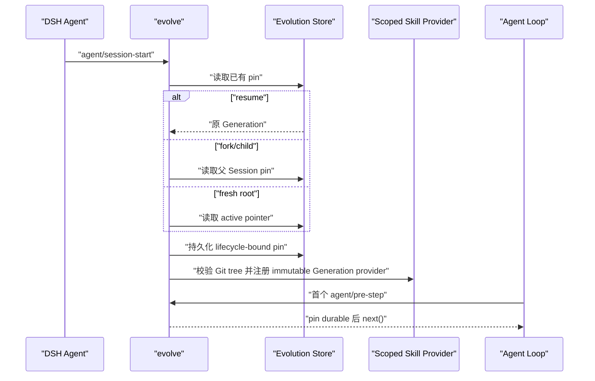

# EvoForge 可证明自进化设计

> 状态：P0A/P0B/P0C、P1.1–P1.21、P2D.1 与内部 Goal→Gap→Skill Opportunity→生成前 Skill Evaluation Evidence Seal→quarantined Candidate→Opportunity-bound Evaluation Envelope v3→capability-absent assembled Shadow/Retention/canary→content-addressed inactive Generation→future Session/root rollback 纵切 implemented；从密封样本自主生成并校准 Case Pack、真实 provider 与真实任务长期证据待完成
> 更新日期：2026-08-19
> 适用范围：单机常驻 DSH、Skill 指令型能力、软件开发交付试验场

## 1. 结论

不存在能够保证对所有未来任务都“越来越聪明”的完美自进化。可实现且值得开源的目标是：

> Agent 从真实任务结果中提出一个小改动，在不影响当前会话的前提下，用相同任务和保留样本证明它优于当前版本；证据充分时只对未来会话原子晋升，证据模糊时异步等待复核，出现回归时能够立即回滚。

因此，自进化不是“模型可以改自己的文件”，而是一个受约束的能力发布系统。它追求的不是修改次数，而是以下结果：

- 用户纠正和返工逐步减少；
- 通过仓库真实检查的交付逐步增加；
- 每次晋升都能解释“改了什么、为什么改、凭什么更好”；
- 当前会话永不被后台学习改变；
- 模糊候选不阻塞正常工作；
- 每个版本有精确内容哈希和回滚目标；
- DSH 的模型可见前缀和 KV Cache 优势不被破坏。

## 2. 首个用户问题

P0 只解决一个窄而真实的问题：

> 同一个用户或团队反复使用 DSH 做软件开发时，Agent 会重复犯相似的流程错误，例如漏读仓库规范、修改后未重跑检查、错误选择工具、重复产生已被纠正的交付格式。系统能否把这些真实纠正沉淀为更好的 Skill，并证明新 Skill 确实降低了同类返工？

软件开发是首个试验场，不是因为产品只服务程序员，而是因为它有较强的客观结果：测试、lint、类型检查、diff、审查意见、Goal 结果、人工返工、耗时、token 与 cache-read。

个人助理、内容、消息和日程以后可以提供新的 Learning Signal 与 Trial case，但不能让 P0 预建通用自治平台。

第一个内部能力不是 Generation Binder，而是由 `dsh-evolve` 插件在 DSH 生命周期内提交的 Shadow evaluation。它只读 active Skill，在一个真实 evaluator 上证明候选评价有用；证明失败就停止，不用发布基础设施掩盖价值缺口。旧独立 CLI 已由 ADR-0041 撤销。

## 3. “完美”的可验证定义

本项目把“完美”改写为六个长期不变量：

1. **Evidence before mutation**：反思只生成假设，真实结果决定晋升。
2. **Inactive by default**：候选永远先处于不生效状态。
3. **Session immutability**：一个 Session 从开始到结束固定使用同一 Capability Generation。
4. **Deterministic gates first**：安全、权限、测试、格式、范围和缓存门槛先于模型判断。
5. **Reversible release**：晋升只切换一个不可变版本指针，不原地修改当前版本。
6. **Foreground independence**：观察、试验、复核和等待审批都不能阻塞产生信号的原会话。

这六项可以被测试。无法被测试的“总体更聪明”不进入产品承诺。

## 4. 产品形态：一个深模块，不是一组内部平台

最终产品只发布一个可选插件；P0A 先以仓库内离线 Shadow 命令验证价值，不承诺为稳定公共接口：

```text
dsh-evolve
  人类界面：/evolve status | review | promote | rollback | pause
  模型工具：无
  常驻提示词：无
```

插件内部可以分文件组织，但不把每个步骤发布成浅插件：

```text
Observer
  → Candidate Lab
  → Trial Runner
  → Decision
  → Release
  → Monitor

Generation Binder
  └─ 为每个 Session 固定一个不可变 Skill Generation

Evolution Store
  └─ 保存紧凑信号、候选状态、版本清单和 Session pin
```

只有两个独立用户结果才值得形成第二个发布插件：

- `Evolve`：让受管 Skill 可证明地进化；
- `Software Delivery`：把原生 Goal 交付为隔离、验证过的 commit 或 Draft PR，并提供客观结果。

软件交付 Pack 对不启用自进化的用户也有独立价值，因此它通过 Feature Extension 检验。Observer、Trial Runner、Promoter 等只是 `evolve` 的内部实现，不单独发布。

## 5. DSH 接缝

| 需要 | 复用的 DSH 能力 | 用法 |
|---|---|---|
| 人类控制 | `ctx.commands` | 注册一个 `/evolve` command；不进入模型工具表面 |
| Skill 供应 | `ctx.skills.registerProvider()` | 在 Agent scope 注册固定 Generation 的 provider |
| Session 生命周期 | `agent/session-start`、`agent/pre-step` | 选择 Generation，并在首个模型步骤前等待 sidecar pin 落盘 |
| 真实过程事实 | `session/event`、`goal/changed` | 记录最小 Learning Signal 引用，不复制完整 transcript |
| 人工反馈 | `domain/changed` 的 `message_feedback` durable snapshot | P1.3 只将带 note 的当前负反馈投影为 reference-only Signal；P1.4 只在配置授权后复制最小 Case Draft；P1.5 只把 exact Draft 交给 proposer；P1.8 要求逐次授权，P1.14/P1.16 可由互斥的静态 Target 策略分别授权自动 Shadow 或 inactive evaluator Draft |
| 持久小状态 | `ctx.storageDomain` | Evolution sidecar；写入先 durable 后改变内存 |
| 后台执行 | `ctx.jobs` | 执行当前进程内候选和 Trial；Job 本身不是 durable authority |
| 重启恢复 | Shadow journal / Evolution Store 扫描 | 只把可安全恢复的未终结状态重新提交给 Jobs |
| 隔离执行 | DSH FS、Shell、Sandbox | 创建候选 worktree 和成对 Trial 环境 |
| 会话事实读取 | Session Persistence / Query | 只在授权的候选生成或评测中按引用读取需要的片段 |
| 成本和缓存 | Token Meter、Session Stats、LLM usage | 对 exact Goal-owned turn 做官方 projection cut 差值；记录 provider token、cache-read/write 与耗时，不虚构货币价格 |
| 权限 | Approval、Permission Preset | 可执行变化和 Protected Action 继续走原生权限管线 |

DSH 的 Skill Registry 本身支持分层 Provider、Agent scope 和 lifecycle disposer：[Skill Registry](https://github.com/deepseek-ai/deepseek-harness/blob/47f943859bef60e4160492346772ded9b24f765a/packages/skill/skill/src/index.ts#L1)。Skill body 不被 registry 缓存，每次 `get()` 重新读取，因此 P0 不能让 Provider 指向一个会原地变化的目录；必须让它读取 immutable Generation。

DSH 的 Agent 创建流程会在首个 prompt assembly 前完成 scoped setup，并提供 `agent/session-start` 与可等待的 `agent/pre-step`：[Agent lifecycle](https://github.com/deepseek-ai/deepseek-harness/blob/47f943859bef60e4160492346772ded9b24f765a/packages/core/agent/src/index.ts#L105)。Storage Domain 的写入语义是“先持久化，再改变权威内存，再发事件”，适合作为 sidecar：[Storage Domain](https://github.com/deepseek-ai/deepseek-harness/blob/47f943859bef60e4160492346772ded9b24f765a/packages/storage/storage-domain/src/domain.ts#L1)。

## 6. 为什么不用 Session 自定义事件保存 Generation

一个直觉方案是在 Session 日志追加 `evolution/generation-pin`。P0 拒绝这个方案：

- DSH 未知且非 ignorable 的 Session event 会使没有安装插件的旧运行时拒绝恢复；
- 插件卸载后，原生 DSH 会话仍应能工作；
- Generation pin 不参与模型历史重建，属于插件 sidecar，而不是 Session 事实。

因此 Generation pin 存在 Evolution Store，使用 `sessionId + createdAt + cwd` 绑定准确 Session 生命周期，沿用 Message Feedback 防止同名 Session 重建后串数据的思路：[Message Feedback identity](https://github.com/deepseek-ai/deepseek-harness/blob/47f943859bef60e4160492346772ded9b24f765a/packages/feedback/message-feedback/src/spec.ts#L42)。

这使插件满足可卸载性：移除 `evolve` 以后，DSH Session 日志没有私有必需事件，只是不再加载 evolved Skill overlay。

## 7. Capability Generation

Capability Generation 是一个不可变清单：

```ts
interface Generation {
  id: string                 // 内容派生 id
  parentId?: string
  createdAt: number
  artifacts: Array<{
    kind: 'skill'
    name: string
    gitCommit: string
    treeHash: string
  }>
  evaluatorVersion: string
  policyVersion: string
}
```

关键语义：

- Generation 不是复制整份 Skill 内容的数据库；Git commit/tree 是内容事实源；
- Evolution Store 只保存清单、索引和状态；
- active pointer 指向一个已经完整写入且校验过的 Generation；
- 晋升只改变 active pointer；
- 回滚把 active pointer 指回祖先 Generation；root 回滚清空 pointer，恢复原生 DSH；
- 已有 Session 的 sidecar pin 永远不跟随 active pointer；
- 新根 Session 使用晋升时的 active pointer；
- fork、continuation child 或 subagent 优先继承父 Session 的 Generation，以保持派生历史的能力语义一致。

## 8. Session Generation Binder

每个 Session 的固定过程：



若 pin 写入失败：

1. 在首个模型步骤前保持或恢复为无 evolved provider；
2. 该 Session 继续使用原生 Skill，不阻塞正常 DSH 会话；
3. 记录可诊断错误；
4. 本 Session 后续不再动态启用 evolved provider，避免模型工具目录中途变化。

若恢复时 pin 指向的 Git tree 丢失或损坏，也不能静默改用最新 Generation；应禁用本 Session 的 evolved overlay 并报告完整性错误。

## 9. Learning Signal

Learning Signal 是“值得调查的事实”，不是“应当写入 Skill 的结论”：

```ts
interface LearningSignal {
  id: string
  kind:
    | 'explicit-correction'
    | 'message-feedback'
    | 'verification-result'
    | 'goal-outcome'
    | 'human-rework'
    | 'cost-regression'
  scope: {
    user?: string
    project?: string
    skill?: string
  }
  source: {
    sessionId?: string
    sessionCreatedAt?: number
    eventSeq?: number
    messageId?: string
    artifactRef?: string
  }
  fingerprint: string
  observedAt: number
}
```

约束：

- 默认不复制完整 prompt、transcript、代码或秘密；
- fingerprint 只用于去重和聚类，不能作为训练事实；
- 单次模型反思、Skill 使用次数、工具调用次数、模型 confidence 和 recency 不能单独触发晋升；
- 一条明确用户纠正可以生成候选，但仍必须通过 Trial；
- 非明确反馈需要同类信号跨至少两个独立 Session 重复，才值得花模型预算生成候选；
- Project signal 默认只能改进 project-scoped Skill；跨至少两个项目证明通用后才能提议上移到 user/global scope。

### 9.1 自我发现 Skill 的唯一运行时语义

自我发现不是运行时搜索、下载、获取、导入或安装任何外部 Skill。它是 DSH 对自身工作经验的
归纳：Goal、Capability Gap、失败、用户纠正、真实 outcome、重复劳动、复用效果和 Retention 证据是
输入；Skill Opportunity 和隔离 Candidate 是输出。Hermes、OpenClaw、HanaAgent、论文与开源实现只在
设计期调研或冻结 benchmark 中使用。

当前最小闭环：

```text
自然语言 Goal
  → DSH 原生能力路由
  → Host 复核并持久化 Capability Gap
  → 同 Workspace / 同 Skill / 至少两个独立 Goal
  → deterministic Skill Opportunity
  → 保守关联同 Session 明确纠正 / stable Goal identity 跨 revision 交付结果（context only）
  → Workspace selfDiscoveryPolicy（无 Skill 字段）
  → 至少四个独立 Goal 后形成 governance-owned Skill Evaluation Evidence Seal
      authoring / admission / holdout 三组不重叠
  → 原生 Job author（只读有界 authoring 子集；看不到 admission/holdout）
  → instruction-only whole-Skill v1
  → inactive / quarantined / unevaluated / never-executed Candidate
  → 当前 Opportunity + evidence seal 对应的 governance-owned Evaluation Envelope v3
      baseline = capability-absent（无 SKILL.md）
  → deterministic admission → independent assembled holdout
  → independent absent-parent Retention / sealed canary
  → explicit review → inactive content-addressed skill-bundle Generation
  → promotion affects future Sessions only / root rollback restores native DSH
```

硬约束：

- 用户只给 Goal，不选路径、Agent、workflow、Skill 或来源；
- 同 Goal 重试、无 Goal、跨 Workspace 或证据不足必须 abstain；
- 纠正只有在同 Session 仅有一种 Gap Skill 且发生于 Gap 之后才关联；Outcome 只有在同一 Goal 的全部已知 Gap 仅有一种 Skill、发生于对应 Gap 之后且 revision 不倒退时才关联；歧义一律丢弃；
- 关联上下文固定 `causalClaim: none`，不能单独产生 Opportunity、改变生成资格/排序、进入 author 输入或证明 Skill 导致结果；
- Outcome metrics 只在 exact active Goal revision 拥有该 turn 时投影，截止 immutable delivery result seq；缺 unit、旧 revision、歧义或计数倒退一律 abstain，且不参与上述资格或治理决定；
- Web 不另建 metrics endpoint/store；`DeliveryOutcomeStore.summarize → EvolutionControlPlane.overview → generated Remote → EvolutionAction` 是唯一浏览器投影链，只暴露聚合和至多 20 条最新已测证据，不暴露 Session/call/reason/path；
- policy 只授权 Workspace、私有 run root、日预算和可能的模型调用，不预定要发现哪个 Skill；
- author 看不到外部搜索结果、验证答案、测试结果或 release 权限；
- Opportunity 只有生成资格，Candidate 只有隔离身份，二者都不能安装、激活、晋升或发布；
- 两个不同 Goal 只形成 Opportunity；至少四个不同 Goal 才能在作者调用前密封 authoring/admission/holdout。证据不足不花预算、不调用模型、不生成 Candidate；
- evidence seal 对 exact Opportunity 快照、三组角色和 author-input digest 内容寻址；Candidate proposer 只收到 authoring 子集，治理目录篡改和作者输入错配均 fail closed；
- Candidate evaluation policy 同样只选择 Workspace 的 governance/run roots，不能配置 Skill、baseline、Case Pack 或 Candidate 方向；
- 一个内容寻址 Evaluation Envelope 必须绑定当前 Opportunity 快照、evidence seal、author-input digest、只含 `subject.json` 的 capability-absent baseline、deterministic admission 与不同的 assembled holdout，任何占位 Skill、漂移、符号链接、根重叠或身份不一致都 fail closed；
- assembled baseline 不安装目标 Skill，Candidate 侧才安装 exact whole-Skill；两侧必须保持非目标 composition 相同；
- 当前实现能解析、验证并贯穿该 Envelope 到 Admission、Shadow、Review 和 crash resume；通过复核的新 Skill 可形成不依赖 Git source 的 inactive `skill-bundle` Generation，Storage 与 DSH Skill Provider 重验 exact archive，晋升只影响未来 Session，root rollback 恢复后续 Session 的 native DSH；
- capability-absent Retention/canary 使用原 Shadow 的 exact subject、Candidate tree/lineage 与 sealed Case Pack，不查 Git/网络，并要求非目标 DSH composition 相同；污染、漂移和父 Generation 已有同名 Skill 均 fail closed；
- 独立 Goal 样本已能在 author 前自动密封，但 admission/holdout Case Pack 与完整 Envelope 还不能由这些密封样本自主生成并校准；真实 provider、负迁移率和长期 outcome 仍是后续治理门，不能由 author 自证。

本项目不提供运行时外部包搜索、获取、下载、导入或市场功能；设计期研究不得进入本节的自我发现状态、UI 或声明。

P1.3 只落地这个设计中的一个具体 Adapter，不实现上面的通用 runtime interface：监听 DSH
`message_feedback/sessions`，把当前 `negative + non-blank note` 投影到专用
`evoforge_feedback_signals` Domain。完整 Session lifecycle 只在事件当下用于精确 Generation
归属；派生值只保留 Session/message 引用、opaque feedback version、时间和 pinned Generation，
不保留 createdAt、cwd 或其 hash，也不保留 note、note hash、Prompt、Transcript 或消息正文。
whole-row 更新允许用户把负反馈改正、删掉或移除 note 后撤回 Signal。它不生成
Candidate；见 [ADR-0017](../adr/0017-explicit-feedback-stays-reference-only.md)。

P1.4 仍不实现通用接口。配置 `feedbackDraftRoot` 只表示允许复制最小原文，用户还必须通过
host-only `/evolve feedback <signal-id> draft` 逐条授权复制，但不再选择目标 Skill。一个私有 Builder
重新读取原生 Message Feedback 与 Session Persistence，从 durable turn 中推导唯一 Skill invocation，
并要求 exact feedback version、同一生命周期的 pinned Generation、一个直接纯文本用户消息和恰好
一次合法 invocation。它保存用户文本、correction、
exact Git artifact、whole-Skill content hash 与 prefix hash，不保存 assistant response、Tool output、Skill body、cwd 或完整
Transcript。输出状态固定为 `draft`，没有 evaluator score，不生成 Candidate。见
[ADR-0018](../adr/0018-feedback-case-drafts-require-explicit-private-copy.md) 与
[ADR-0051](../adr/0051-feedback-draft-derives-skill-from-durable-invocation.md)。

P1.5 不生成 evaluator，也不新增 Case 平台。用户显式执行
`shadow ... --feedback-draft <private-draft.json>`，即授权一次可能付费的 proposer 请求和该草稿最小
原文外发。读取过程拒绝 symlink/宽权限/篡改，要求 target Skill 名和 whole-Skill content hash 与
本次 baseline 完全相同；直接用户文本和 correction 只作为标记为 untrusted 的 proposer 搜索证据。
既有 Case Pack 的 calibration 与 hidden evaluator 完全不变，仍是唯一 Decision 真相。durable state
新增字段只保存 draft id 和私有恢复路径，不直接复制原文；proposer 回显可能随 Candidate/claim
持久化。已有 Candidate 的 resident recovery 不重复 proposer。
见 [ADR-0019](../adr/0019-feedback-guides-search-not-evaluation.md)。

P1.6 把同一个 Trial Runner 深化为两个内部动作：`runCalibrationTrial` 运行 known-bad/correction，
`runComparisonTrial` 运行 baseline/Candidate；完整 `runPairedTrial` 仍组合为四次执行。独立
插件内部 calibration 只调用前者并生成零模型报告。完整 Shadow 在 prepared 阶段也先调用前者，
只有方向正确才 durable 记录 proposer intent；当前进程随后只运行 comparison，因此总数不变。
Candidate resume 为避免信任过期的内存结果，会重新运行完整 paired Trial，但不重复 proposer。见
[ADR-0020](../adr/0020-calibrate-case-packs-before-proposals.md)。

## 10. Candidate

候选永远是 inactive Git commit，并包含一个可证伪主张：

```ts
interface Candidate {
  id: string
  artifact: { kind: 'skill'; name: string }
  baseGenerationId: string
  commit: string
  signalIds: string[]
  claim: {
    expectedImprovement: string
    primaryMetric: string
    minimumMargin: number
    forbiddenRegressions: string[]
  }
  cases: {
    reproduction: string[]
    retained: string[]
  }
  status:
    | 'proposing'
    | 'ready'
    | 'testing'
    | 'review'
    | 'rejected'
    | 'promoted'
    | 'rolled-back'
}
```

候选生成规则：

- 在独立 worktree 中修改；
- 只能修改显式 owned 的 Skill；
- 不修改已安装、bundled、组织共享或第三方 Skill；
- 不直接修改 active branch 或 active Generation；
- 优先替换、澄清或删除错误指令，不鼓励无止境追加文本；
- 每个候选只解决一个相对独立的 claim；
- 生成失败或超预算不会影响原会话。

候选搜索不是本插件的独特价值。P0A 先使用最小 patch proposer；若简单搜索无法覆盖真实失败，再以内置私有适配调用 GEPA。只有出现第二个真实 optimizer 后才发布公共 optimizer 接口。

## 11. Paired Trial

数据严格分为三层：

- `search`：允许 proposer/optimizer 使用，用于生成和迭代候选；
- `selection`：用于候选比较，可以重复使用，但不能被写入候选提示；
- `final-test`：一次搜索结束前保持未开放，只用于决定本轮结果；反复使用后必须降级并补充新 case。

Baseline 和 Candidate 使用：

- 相同任务输入；
- 相同仓库基线 commit；
- 相同模型 route、工具集合、权限和预算；
- 分离且干净的 worktree；
- 相同的 deterministic checks；
- 独立 Session；
- 相同完整 composition，唯一允许的能力差异是被测试 Skill 的内容版本。

评测顺序不可被模型改写：

1. 权限与 Protected Action；
2. 候选 diff 范围和 Skill 格式；
3. 仓库 tests、lint、typecheck、build 或用户验收命令；
4. 触发问题是否复现并被修复；
5. retained cases 是否回归；
6. 人工纠正或返工是否减少；
7. latency、token、cache-read 和 Skill 长度；
8. 只有剩余主观差异才允许 blind model judge。

模型 judge：

- 看不到哪个输出来自 Candidate；
- 只能补充主观评价；
- 不能覆盖安全、权限、测试和缓存 hard gate；
- 其判断单独存在时永远不能自动晋升。

Trial 的随机模型输出无法保证逐 token 重现。可重现的是：固定输入、版本、模型配置、工具 composition、检查命令、原始输出和评测程序；给定已经保存的 Trial 结果，Decision 必须是纯函数并稳定重放。

确定性 case 可以单次判定；随机 case 必须使用预声明的最小复跑数、相同 paired 配置和明确的 tie policy。模型 route、provider、模型版本或 evaluator 变化会开启新的 evaluation epoch，不能直接继承旧分数。证据不足只能 `review` 或 `reject`。

## 12. 简单的晋升政策

P0 不设计通用评分语言，只保留三种结果：

| 条件 | 结果 |
|---|---|
| 任一 hard gate 失败；Candidate 没有修复 claim；retained case 回归 | `reject` |
| 只有主观收益；样本不足；指标互有胜负；scope 发生扩大 | `review` |
| 所有 hard gate 通过，达到预声明 margin，无 retained regression，rollback rehearsal 成功 | `promote` 或 shadow recommendation |

自动晋升还必须同时满足：

- 当前模式是 `auto-instructions`，而不是默认 `shadow`；
- 只改变 Markdown 指令和同目录非执行型 reference/template；
- 不增加脚本、binary、工具、权限、秘密、网络目标或外部效果；
- 不提高 Protected Action、秘密访问、网络目标或不可逆动作的请求概率；不能仅凭 `.md` 扩展名推定低风险；
- 至少满足以下一个清晰证据条件：
  - 修复一个 baseline 可重复失败、Candidate 稳定通过的 deterministic case；或
  - 在至少两个独立任务上消除同类明确纠正；
- 全部 retained cases 通过；
- 完整 composition 的缓存回归在预算内；
- 候选 Generation 已完成一次切换与回滚演练。

可执行脚本、插件源码、工具 Schema、权限、部署行为和外部动作只能生成 commit 或 Draft PR，不能由 P0 自动激活。

## 13. Release 与 rollback

Promotion 是两阶段的：

1. 先写入并校验 immutable Generation 记录和 Git tree；
2. 再用 Storage Domain 的单个 global 写入切换 active pointer。

崩溃语义：

- 指针切换前崩溃：Candidate 仍 inactive；
- 指针切换后崩溃：新 Session 使用新 Generation；
- Candidate 状态还没写成 `promoted` 时，恢复器以 active pointer 为准补齐派生状态；
- active pointer 永远不能指向不存在或未校验的 Generation。

Rollback 使用相同机制，把 active pointer 指回已验证的 parent；root 回滚则清空 pointer，令未来 Session 使用原生 DSH。已有 Session 不切换；回滚只影响之后创建的未 pin Session。它只能恢复能力版本，不能撤销已经发送的消息、创建的日程、付费、部署或数据修改。

## 14. Post-promotion monitoring

晋升不是终点。P1.2 当前只接一个客观、已实现的触发器：归属于自动晋升 Generation 的失败
Delivery Outcome。它不是回滚票，而是要求重放原证据：

- 读取原 Shadow run 的 Case Pack、hash 与 evaluator epoch；
- 从不可变 Git artifact 物化 Candidate 及其精确 parent；
- 用相同 known-bad/known-correction 和 evaluator 跑四次 Sealed Trial；
- 校准通过、parent 通过、Candidate 失败且 active 仍是该 Candidate：自动回滚 future Session；
- Candidate 仍通过：保持；parent 也失败、校准/证据漂移或 active 已变化：进入 review。

一次回滚后 active 不再是该 Candidate，因此其后续 Outcome 不会再次移动指针，避免两个版本之间
振荡。再次晋升必须产生新 Candidate 和新 Trial。原 Session 永不等待 canary，已有 Session pin
不漂移。详见 [ADR-0016](../adr/0016-rollback-requires-counterfactual-canary.md)。

## 15. 单机常驻与崩溃恢复

进程拉起交给 systemd、launchd 或用户已有的 DSH 启动方式，插件不实现第二个 daemon manager。

Generation 以 Evolution Storage Domain 为 durable authority；Shadow/canary run 以 owned output directory 的 run-local journal 为 authority；`ctx.jobs` 只负责当前进程观察和取消。插件不创建第二个调度数据库。`--resume` 或配置的 resident supervisor 按下表处理：

| 状态 | 恢复动作 |
|---|---|
| `proposal-pending` 且无 durable response | 标记 uncertain，不自动重复可能收费的外部请求 |
| `candidate-ready` / `trial-running` | 复用已落盘 Candidate，只重跑无网络、owned workspace 内的 Sealed Trial；resident supervisor 唯一自动处理的状态 |
| `review` | 不做任何模型工作，继续等待异步人工选择 |
| Generation 已写、active 未切换 | 保持 inactive，可重新执行 promotion |
| active 已切换、Candidate 未标 promoted | 依据指针补齐 Candidate 状态 |
| canary `trial-running` | 复跑同一无提案模型的 exact parent/Candidate Trial |
| canary `rollback-pending` | 以 active pointer 为事实补齐结果；只在仍指向 Candidate 时移动一次 |
| 临时 worktree 残留 | 验证 owner marker 后回收；不碰未知目录 |

不需要 Lease、分布式选主、通用 DAG 或第二套事件溯源。单进程内部用 owner lock、一条状态写入链和稳定 idempotency key 防止并发重复；兼容 Provider 不保证服务端 exactly-once，因此请求结果不确定时必须停止而非乐观重试。

Resident supervisor 只扫描配置 root 的直接子目录，不跟随符号链接，并串行提交原生
`evolution` Job；完成 Shadow 扫描后在同一生命周期处理自动晋升和 canary，不另起 daemon。
DSH 关闭时 Job 取消信号杀死完整 Sealed Trial 进程组，但不把该 run 误写成终态；下次启动继续。
具体权衡见 [ADR-0009](../adr/0009-journal-authority-native-jobs-observability.md)。

## 16. 持久状态的最小形状

权威 Generation 和可从原生 Session 日志重建的派生 Outcome 故意分域，长证据留在 owned run 目录：

```text
Evolution Domain
  global: activeGenerationId, recoveryPaused
  tables: generations, sessionPins

Delivery Outcome Domain
  tables: outcomes (bounded compact derived signals + optional exact Goal projection metrics)

browser-safe overview projection
  rollups: all, selected, optional baseline
  recent: at most 20 measured outcomes, newest first

owned Shadow run directory
  run-state.json, report.json, review-state.json, canary/<outcome>/state.json
```

不建立：

- transcript 副本；
- 通用 Evidence Graph；
- Memory 数据库；
- 任务 DAG；
- Approval 数据库；
- 事件总线持久化镜像；
- 全局万能评分。

`review` inbox 直接投影已完成的 Shadow evidence 和旁置 disposition，不复制 Candidate 数据库。
Canary journal 与原 evidence 共址；原 Case Pack 丢失或漂移时 fail closed。

浏览器只保存当前渲染快照。Remote 刷新失败时界面显式显示错误并保留最后一次成功快照；Host 恢复后的下一次
成功读取原子替换该快照。这个行为用于可诊断恢复，不把浏览器变成事实来源，也不把缺失 metrics 解释为零。

## 17. KV Cache 约束

`evolve` 默认对正常模型请求做到：

- 零常驻 system prompt；
- 零新增模型工具；
- 零每轮时间戳、版本号或状态注入；
- Observation 只在 host plane；
- Generation 在 Session 内不可变；
- Skill catalog 的 name、description 和顺序在 Session 内不可变；
- Skill body 只在原生 `skill` 工具实际加载时成为后缀内容；
- Baseline/Candidate Trial 复用相同基础 composition；
- Candidate 只允许改变被测 Skill body，不借机改变工具 Schema；
- cache 指标必须测完整请求 composition，不能由插件自报。

修改 Skill description 会改变新 Session 的 catalog 前缀，因此除非 routing 本身是 claim 的对象，P0 候选默认不修改 name/description，只修改 body。必须修改时需要单独记录 prefix change 和 cache 预算。

## 18. 权限矩阵

| 动作 | 默认 |
|---|---|
| 读取授权的 Session/Goal/feedback 引用 | 允许 |
| 创建候选 worktree | 允许 |
| 编辑受管 Skill | 允许，但候选 inactive |
| 执行本地 Trial 和仓库检查 | 允许 |
| 创建 commit | 允许 |
| 创建 Draft PR | 允许 |
| 自动激活通过验证的纯指令 Candidate | 仅 `auto-instructions` 模式 |
| 激活脚本、插件代码、工具或权限变化 | 禁止自动 |
| merge、release、生产部署 | Protected Action |
| 读取秘密、付费、不可逆外部动作 | Protected Action |

Candidate 不能通过修改自身评测政策、held-out cases 或权限配置来使自己通过。Evaluator 与 policy 版本属于受保护的产品代码，不是 P0 evolvable artifact。

## 19. 防止“越进化越差”

必须同时防御五类失败：

1. **自我确认**：Proposer 不负责 Decision；模型 judge 不能覆盖 hard gate。
2. **过拟合**：触发 case 之外必须有 proposer 未见的 retained cases。
3. **指令膨胀**：记录 Skill 字节数和 token；收益相同优先更短 Candidate。
4. **指标投机**：每个 Candidate 只有一个主要 claim，但必须通过全局安全、权限、缓存和回归门。
5. **作用域污染**：project 经验默认留在 project；跨项目证明后才可上移。

系统不追求所有任务上单调改进，只承诺在 Candidate 声明的 scope 和 trial distribution 上有证据的改进，并持续监测该证据是否失效。

## 20. P0 test-first 规格

每一阶段只实现对应的失败测试；P0A 不提前建设 P0B/P0C：

### P0A — Candidate isolation

1. Candidate worktree 中的修改不会改变 active tree；
2. 非 owned 路径修改被拒绝；
3. executable 文件变化不能进入 auto-promote；
4. Candidate 失败和取消能安全清理或保留可恢复 worktree。

### P0A — Trial 与 Decision

5. known-bad Candidate 被 deterministic gate 拒绝；
6. 修复触发 case 且通过 retained cases 的 Candidate 得到 promote recommendation；
7. 只有 model judge 偏好的 Candidate 进入 review；
8. baseline 与 Candidate 的非目标 composition 不一致时 Trial 无效；
9. cache regression 超预算时不能自动晋升；
10. 已保存 Trial result 重放得到同一 Decision；
11. proposer 不能读取 selection/final-test；final-test 只在搜索结束后开放；
12. 随机 case 未达到预声明复跑数时不能给出自动晋升建议；
13. evaluator 或模型 epoch 改变后不能沿用旧分数。

### P0B — Generation 与 Session

14. 新 Session pin 当前 Generation；
15. promotion 后旧 Session 仍读取原 Skill body；
16. 新 Session 读取新 Skill body；
17. resume 恢复原 pin；
18. fork/child 继承父 pin；
19. pin 持久化失败时卸载 overlay，但原生会话继续；
20. 插件卸载后原生 Session 仍能恢复。

### P0B/P0C — Promotion 与恢复

21. 在 propose、test、Generation 写入、pointer 切换前后注入崩溃；
22. 每个崩溃点恢复后无重复 Candidate、无半激活版本；
23. rollback 恢复精确 Git tree hash；
24. promotion/rollback 不改变任何 live Session；
25. ambiguous review 永不阻塞原会话。

### 全阶段 — 权限

26. merge、release、部署、秘密、付费与不可逆动作不能由 Candidate 激活；
27. Markdown Candidate 增加工具、秘密、网络或外部效果请求时必须 review；
28. Candidate 不能修改 evaluator、policy 或 held-out case 后自动通过；
29. 所有 Git/worktree 删除只作用于带 owner marker 的精确路径。

## 21. 分阶段实现

### P0A — 离线 Shadow 价值验证

- 一个用户真实使用的软件开发 Skill；
- 3–5 个 deterministic reproduction cases；
- 分离的 `search`、`selection` 和未开放 `final-test`；
- 最小 patch proposer，可选私有 GEPA adapter；
- baseline/candidate 报告和 `promote | review | reject` recommendation；
- 只读 active Skill，不注册在线 Provider，不激活 Candidate。

退出条件：稳定拒绝故意构造的坏 Candidate，并至少找到一个通过 final-test 的真实改善。做不到就停止扩展。

### P0B — Release safety

- Evolution Storage Domain 和 immutable Generation manifest；
- Session sidecar pin 与 scoped Skill Provider；
- active pointer 原子切换；
- crash recovery、rollback rehearsal 和 composition fingerprint；
- promotion 只影响 future Session。
- resident supervisor 只恢复 durable、无网络 Trial，当前执行复用 DSH Jobs；
- DSH 关闭取消 Trial 后保留可恢复 journal，不创建第二 daemon manager。

进入条件：P0A 已经证明 evaluator 和 Candidate 对真实任务有价值。

### P0C — 异步人工晋升

- `/evolve status | review | promote | rollback | pause`；
- 所有真正激活仍由人工决定；
- review 不阻塞原会话，证据不足和过期候选自动关闭。

### P1 — 极窄自动晋升

- 只开放 project-scoped、owned、纯指令、权限效果不变的 `auto-instructions`；
- clear-win policy、future-session canary、反事实监测和自动回滚；
- 主观、混合或无法重放的结果继续异步 review。

### P2 — 可执行能力建议

- 插件源码和脚本 Candidate 只产生 commit/Draft PR，不自动激活；
- 第二种 artifact 和第二个 optimizer 分别出现后，才抽取对应公共 seam。

### P3 — 通用自治数据源

- 首个场景已选择独立 `dsh-telegram` 单私聊 Adapter；它只把结果和显式反馈接到既有 DSH/Evolve
  seam，不扩张 Evolve 的状态模型；真实 adoption/outcome 证据出现前不增加第二渠道；
- 不改变 `evolve` 的用户心智模型。

## 22. 成功与停止条件

P0A 先回答“是否值得做”：

- evaluator 能稳定拒绝故意构造的坏 Candidate；
- 至少一个纠正驱动的 Candidate 修复触发 case，并通过一次未参与搜索的 final-test；
- 相同 Trial 结果可确定性重放 Decision；
- 人工能够从报告理解 claim、diff、证据、成本和局限。

只有 P0A 通过后才建设 P0B。P0B/P0C 只有同时达到以下结果才允许进入自动晋升：

- 原 Session 和其他 live Session 零行为变化；
- 每个 crash injection point 都能恢复；
- promotion 与 rollback 精确复现 artifact hash；
- Session 内 composition fingerprint 保持稳定；
- 未发生 Protected Action；
- ambiguous case 全部进入异步 review；
- 安装和看到第一个 shadow result 的步骤足够短，普通 DSH 用户能够完成。

若 Candidate 生成很活跃，但返工、验证通过率或用户信任没有改善，应停止扩展而不是增加更多自治层。

## 23. 下一步

P0A 与 P0B 的实现证据已经分别收敛到 [P0A Shadow 契约](p0a-shadow-contract.zh.md)、
[P0B.1 release kernel](../evidence/p0b-1-generation-release-kernel.zh.md)、
[P0B.2a durable resume](../evidence/p0b-2a-durable-shadow-resume.zh.md)和
[P0B.2b resident supervisor](../evidence/p0b-2b-resident-shadow-supervisor.zh.md)。
P0C.1 已用 host-only `/evolve status | promote | rollback` 暴露 release；P0C.2 已把
durable Shadow evidence 投影为 review inbox，并把人工批准发布为不激活的 immutable
Generation，证据见 [P0C.2](../evidence/p0c-2-review-to-inactive-generation.zh.md)。
P0C.3 已提供 durable resident pause/resume，证据见
[P0C.3](../evidence/p0c-3-durable-resident-pause-resume.zh.md)。P0C.4 复用 publication 的
exact Git baseline/Candidate gate，在同一 detail 中显示 control-safe bounded diff，见
[P0C.4](../evidence/p0c-4-verified-diff-preview.zh.md)。P0C.5 在相同 exact 变更上投影固定、保守的
protected-effect 词法类别，并与 P1.1 复用 detector；它不是语义安全证明，见
[P0C.5](../evidence/p0c-5-protected-effect-projection.zh.md)。P0C 不增加模型 Tool，也不让审批等待
阻塞产生信号的原会话。P1.1 已实现默认关闭、allowlist、append-only 的
clear-instruction 自动晋升，证据见
[P1.1](../evidence/p1-1-opt-in-clear-instruction-auto-promotion.zh.md)。P2D.1 已从原生 Session 中
source-sequence-linked 的 `tool/call → tool/result` 接入真实 Software Delivery 三态 outcome，
只在官方 awaited Session durability checkpoint 成功后投影，在 cold Session start 幂等补记，并关联
Session-pinned Generation；
该信号异步、host-only、零模型表面，见
[P2D.1](../evidence/p2d-1-delivery-outcome-signal.zh.md)。P1.2 已实现 exact Git
active-vs-parent sealed canary、原生 Jobs 与 crash-safe rollback，见
[P1.2](../evidence/p1-2-counterfactual-canary.zh.md)。P1.3 已复用原生 Message Feedback 提供
reference-only、可撤回、零模型表面的明确纠正入口，见
[P1.3](../evidence/p1-3-explicit-feedback-intake.zh.md)。P1.4 已在双重授权下生成私有、内容寻址、
未评分的 Feedback Case Draft，见
[P1.4](../evidence/p1-4-private-feedback-case-draft.zh.md)。P1.5 已允许 exact Draft 只引导一次显式
Shadow proposer，同时由既有校准 Case Pack 独立评测，见
[P1.5](../evidence/p1-5-feedback-guided-shadow.zh.md)。
P1.6 已提供零模型独立校准，并让完整 Shadow 在 proposer 前 fail closed，见
[P1.6](../evidence/p1-6-preproposal-case-pack-calibration.zh.md)。P1.7 已把一个新失败的最窄
evaluator authoring 流程沉淀为显式、非隐式注入 Skill，要求独立 observable、negative controls、
known-bad/correction 与零模型校准，见 [P1.7](../evidence/p1-7-evaluator-authoring-skill.zh.md)。

P1.9 在同一 `dsh-evolve` 内补最窄深模块，不新增插件或 Case 平台：静态 Evaluator Target 只暴露
公开 id；显式 Author 把 exact Feedback Case Draft 和 exact Skill 交给一次有界 provider 请求，host
固定生成 manifest 并把 exact active Skill 作为 known-bad，模型只提议 evidence、known-correction
与 evaluator。结果先是不可执行、内容寻址的私有 Evaluator Draft；独立人工批准 exact hash 后才
允许 sealed qualification，方向成立仅发布 immutable Qualified Case Pack，不能直接成为 Shadow、
Candidate 或 Promotion。原反馈 Session 永不等待，普通模型 request composition 不变。契约见
[P1.9](p1-9-evaluator-draft-contract.zh.md)与 [ADR-0029](../adr/0029-generated-evaluators-remain-inactive-until-human-qualified.md)。

P1.10 只消除 qualified 结果的手工路径死端：可选静态 `shadowRunRoot` 让新的显式动作从 P1.9
journal 恢复 exact Pack/hash，再委托 P1.8 同一个 launcher、Jobs、run journal、calibration、paired
Trial 与 review。它不自动启动、不复制 Shadow phase、不允许浏览器提交 path，也不绕过 Candidate 或
Promotion。见 [P1.10](p1-10-qualified-shadow-handoff.zh.md)与
[ADR-0030](../adr/0030-qualified-case-packs-enter-shadow-only-through-a-new-explicit-action.md)。

不扩建通用 Signal/Memory/Case 平台；首个新失败已完成 keyless red→green→bounded Shadow 与可回滚
Skill 晋升；P1.9/P1.10 已通过真实 DSH 纵向链路、既有崩溃恢复边界与 packed lifecycle 实现门。下一步由独立陌生作者复跑，并用真实 provider 与用户纠正测量 qualified rate、semantic rejection rate、成本与后续候选改善率，
继续测量 false promotion、false rollback、review rate、返工与成本。
P0C 仍需普通用户完成控制任务的可用性退出证据。

P1.14 只为“已有可信 Case Pack”的明确纠错消除逐次 Shadow 命令：`automaticFeedbackTargets` 引用一个
既有 P1.8 Target 并固定 exact hash，配置同时授权最小私有 copy、一次潜在付费 proposer/evaluator 和
受限纠正外发。Supervisor 每轮最多启动一个；pinned Generation 必须只匹配一个授权 Skill。它复用
原生 Jobs、Shadow journal、Review、P1.13 Retention、P1.1 Promotion 与 Generation rollback；
`proposal-pending` 不自动重试，任何歧义都留在异步人工区，原 Session 不等待且 normal model request
不变。见 [P1.14](p1-14-automatic-feedback-shadow.zh.md)与
[ADR-0034](../adr/0034-explicit-feedback-may-enter-one-static-shadow-target.md)。

P1.15 不增加通用调度或 token 账本，只在 P1.14 的自动付费边界前为每个 exact Target 预留一个
crash-safe UTC 日 attempt。单次 token 上限仍属于 Case Pack；日 cap、损坏 fail closed 与
Commands/Web 状态都留在 host plane。显式人工动作继续逐次授权。见
[P1.15](p1-15-automatic-evolution-budget.zh.md)与
[ADR-0035](../adr/0035-automatic-evolution-reserves-budget-before-paid-launch.md)。

P1.16 只消除新失败在 P1.9 author 前的机械动作：静态、默认关闭的部署策略允许一个仍然当前的明确
纠正，在唯一 Skill 匹配和日预算预留后生成私有 inactive Evaluator Draft。它不自动执行、qualification、
Shadow 或 Promotion；P1.14 与 P1.16 对同一 Skill 互斥，任何歧义或不确定外部结果留给异步人工。
普通 Session composition 不变。见 [P1.16](p1-16-automatic-evaluator-draft.zh.md)与
[ADR-0036](../adr/0036-explicit-correction-may-create-one-inactive-evaluator-draft.md)。

P1.17 只组合已有人工权限：审查者可用一次确认先运行 P1.9 sealed qualification，并在成功时进入
P1.10 paid Shadow。失败时 proposer 为 `0`；qualification 已持久化后的重试不重复执行 evaluator；
分步动作和独立 Promotion 保留。普通 Session composition 不变。见
[P1.17](p1-17-human-approved-qualify-and-shadow.zh.md)与
[ADR-0037](../adr/0037-one-human-action-may-qualify-and-start-shadow.md)。

P1.18 在 P1.14/P1.16 的预算预留前读取已有 Evaluator Draft、Shadow journal 与 actionable Review
Candidate。同一 Skill 尚有未决自动工作时，新 Signal 留在原 store 后续再查，provider 与预算增量为
零；状态不可读 fail closed。它不新增 queue/lease/config，也不限制逐次人工动作。见
[P1.18](p1-18-per-skill-automatic-inflight-gate.zh.md)与
[ADR-0039](../adr/0039-automatic-evolution-keeps-one-unresolved-path-per-skill.md)。

P1.19 为 P1.18 增加一个最小活性边界：Automatic Feedback Shadow 产生、且 evaluator 只能给出
`review` 的 Candidate 默认保留 168 小时。下一条同 Skill Signal 才触发预算前 durable rejection；
所有证据保留，人工、明确 `promote`、未激活或不可读状态仍 fail closed。它不增加 timer、通知、
后台清理器或模型表面。见 [P1.19](p1-19-automatic-ambiguous-review-expiry.zh.md)与
[ADR-0040](../adr/0040-automatic-ambiguous-review-has-a-bounded-window.md)。

P1.20 不改变 P1.19 state machine，只从 Review Inbox 的相同 policy/provenance/completion facts 派生
`eligibleAt/eligible/trigger`。Commands 与 Web 读取同一 host projection；Web 只在打开、显式刷新或动作后
读取，详情刷新会清掉已失效表单。它没有 timer、polling、持久新字段、动作或模型表面。见
[P1.20](p1-20-automatic-review-window-visibility.zh.md)与
[ADR-0025](../adr/0025-web-is-a-thin-kv-safe-adapter.md)。

P1.21 在 P2D.1 的同一有界 store 遍历中，为 active Generation 增加 exact parent/native DSH counter。
Commands/Web 显示三态观察计数与固定因果免责声明；不计算提升率、不自动 release，也不增加采集字段、
持久状态或模型表面。真正归因仍只由 P1.2 sealed counterfactual canary 给出。见
[P1.21](p1-21-parent-generation-outcome-comparison.zh.md)与
[ADR-0015](../adr/0015-delivery-outcomes-are-derived-signals.md)。
