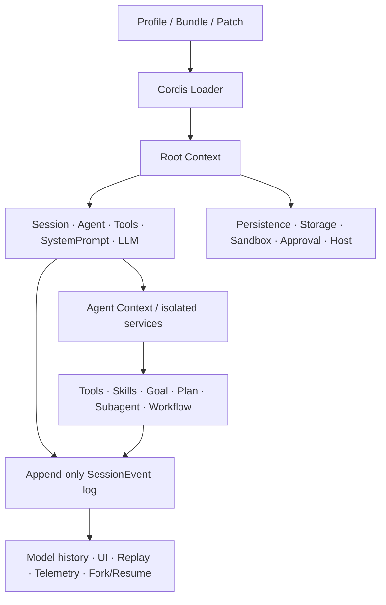

# DeepSeek Harness 架构与设计审计

> 审计对象：`deepseek-ai/deepseek-harness`
> Revision：`47f943859bef60e4160492346772ded9b24f765a`
> 分支状态：`master...origin/master`，工作树干净
> 审计日期：2026-08-15
> 证据范围：源码、测试约束、生成目录、包 README、Bundle 与 Agent Preset 配置。本文中的“当前”“原生”均只指上述 revision。

## 1. 一句话结论

DeepSeek Harness（下称 DSH）是一个基于 Cordis 的可组合 Agent Runtime。它最重要的设计并不是“插件很多”，而是把运行时拆成四个可以分别推理的平面：

1. Cordis 的服务图与可逆生命周期；
2. Session 追加日志这一模型上下文事实源；
3. Definition / Provider / Consumer 三段式能力接缝；
4. 根级部署组合与 Agent 级作用域组合。

DSH 所说的“一切皆插件”对产品组件基本成立：模型适配器、工具注册表、Session、Agent、默认 Agent Loop 都从配置装载并可替换，官方架构也明确说不存在需要打补丁的“特权产品核心”：[architecture.md](/Users/my/harness/deepseek-harness/docs/architecture.md:9)。不过 Cordis、Loader、配置解释器、事件协议和 Session 格式仍构成元内核。更准确的理解是：**产品脊柱可组合，不是系统没有内核**。

## 2. 审计口径与成熟度

根包版本是 `0.1.0-rc.5`：[package.json](/Users/my/harness/deepseek-harness/package.json:1)。仓库同时明确处于首次正式发布前：当前没有外部消费者，允许自由重命名和重打包，旧磁盘格式可直接拒绝，`SESSION_FORMAT_VERSION` 也没有兼容承诺：[AGENTS.md](/Users/my/harness/deepseek-harness/AGENTS.md:5)。因此本文区分两件事：

- “设计成熟”：很多关键契约、不变量和失败语义已经非常严谨；
- “生态稳定”：插件 ABI、磁盘兼容性和升级承诺还没有达到正式版本水平。

完整插件统计另见 [DSH 原生插件目录](deepseek-harness-native-plugins.zh.md)。源码核验口径为 219 个 `packages/*/*` 包，其中 171 个真实可加载 Cordis 插件、15 个不可直接加载的抽象 Definition、33 个 library。171 个里有 168 个产品插件、2 个 example、1 个 replay 测试插件。

## 3. 总体结构



官方列出的产品脊柱包括：

| 脊柱 | 所有权 | Context key |
|---|---|---|
| `core/session` | 追加 SessionEvent 日志与内存 SessionStore | `ctx.sessions` |
| `core/system-prompt` | System Prompt section 与工具 Schema 组装 | `ctx.systemPrompt` |
| `core/tools` | 作用域化工具注册和受保护执行管线 | `ctx.tools` |
| `core/agent` | Agent 接口、live registry、`agent/*` 事件 | `ctx.agents` |
| `core/agent-loop` | 默认 Agent driver | `ctx.agentLoop` |
| `llm/llm` | 消息、流和模型适配器接缝 | `ctx.llm` |

该表的源码说明位于 [architecture.md](/Users/my/harness/deepseek-harness/docs/architecture.md:39)。`core/scope` 是无 Context key 的作用域库，而不是独立运行服务。

## 4. 启动、Profile、Bundle 与 Patch

一个 DSH 进程不是从固定依赖清单启动，而是从空插件树按层合成：

```text
按 profile 声明顺序的 bundle
→ profile/cordis.patch.yml
→ DSH_HOME/cordis.patch.yml
→ --patch 与命令行派生 overlay
```

Profile 位于 Harness Home，保存 Bundle 清单、out-of-tree 依赖和用户 patch；Bundle 是携带 `cordis.patch.yml` 的 npm 分发单元。`dsh-base` 是 web/headless 的共同底座，随后分别叠加 `dsh-web-app` 或 `dsh-headless`：[architecture.md](/Users/my/harness/deepseek-harness/docs/architecture.md:15)。解析使用安装目录与 Profile 目录两个 module-resolution anchor，允许官方包和用户安装包共存：[profile.ts](/Users/my/harness/deepseek-harness/packages/boot/app-boot/src/profile.ts:1)。

Patch 的关键语义：

- 用稳定 `id` 定位 row；
- 可以向根或 group 插入 row；
- 同层中刚插入的 row 可被后续 patch 继续修改；
- patch 的 `config` 是整体替换，不是深合并；
- 未命中、目标不是 group、或 name 不匹配时告警并跳过。

实现见 [include/index.ts](/Users/my/harness/deepseek-harness/vendor/include/src/index.ts:43)。这使配置可审计且 `--dump-config` 与真实启动共用同一算法，但“告警后继续”和“整体替换”也是运维脚枪：一处拼错可能产生静默配置漂移。

Bundle 文件中特别注明，row 顺序只服务于阅读，**没有启动语义**；真实激活顺序由 Service 是否可用决定：[base/cordis.patch.yml](/Users/my/harness/deepseek-harness/packages/bundle/base/cordis.patch.yml:1)。

## 5. Cordis：一切皆插件的实现基础

### 5.1 Plugin 与 Context

Cordis 支持函数插件、对象插件和 `Service` 子类。`Context` 是服务仓库；插件通过稳定的 `ctx.<key>` 找能力，而不是导入具体实现。`inject` 声明所需服务，插件会等待依赖可用；它表达的是拓扑，不是手工启动顺序：[cordis-primer.md](/Users/my/harness/deepseek-harness/docs/cordis-primer.md:7)。

Context 通过 Proxy 把服务解析委托给当前作用域，并能创建子 Context：[context.ts](/Users/my/harness/deepseek-harness/vendor/cordis/src/context.ts:36)。Service 构造时通过 reflection 发布自己，fiber 销毁时自动撤销：[service.ts](/Users/my/harness/deepseek-harness/vendor/cordis/src/service.ts:5)。

### 5.2 Fiber 与可逆 Effect

每次插件激活都对应一个 Fiber，Fiber 持有：

- 当前插件 Context；
- 已解析依赖快照；
- 原始与校验后的配置；
- 生命周期状态；
- 监听器、注册项与 disposer；
- 加载/卸载中的异步惯性状态。

注册通过 `ctx.effect()`、`ctx.on()`、Service provide 或工具注册进入 fiber。卸载时 disposer 逆序执行，重复 dispose 是 no-op：[fiber.ts](/Users/my/harness/deepseek-harness/vendor/cordis/src/fiber.ts:402)。依赖实现变化会通过 reflection 通知 Fiber 刷新：[reflect.ts](/Users/my/harness/deepseek-harness/vendor/cordis/src/reflect.ts:267)。

Loader 更新具有事务味道：能原位 patch 的配置若应用失败会回滚；更换插件时先导入候选，卸载旧实现，再启动新实现；启动失败则尝试恢复旧实现：[entry.ts](/Users/my/harness/deepseek-harness/vendor/loader/src/config/entry.ts:145)。优点是失败可见且尽力恢复；限制是 replacement 不是双运行原子切换，存在短暂空窗，回滚本身也可能失败。

### 5.3 Event

Cordis 的事件模式是公开契约：

| 模式 | 等待 | 语义 |
|---|---|---|
| `emit` | 否 | 按注册顺序观察 |
| `waterfall` | 否 | around middleware，可改写或短路 |
| `parallel` | 是 | 并发 fan-out |
| `serial` | 是 | 顺序执行并返回结果 |

`waterfall` 的 listener 必须调用 `next()` 才会委托下游；不调用即短路：[cordis-primer.md](/Users/my/harness/deepseek-harness/docs/cordis-primer.md:15)。Agent 请求、LLM stream 和工具执行策略正是以此构成可插拔中间件。

## 6. Capability seam：Definition / Provider / Consumer

DSH 把可替换能力拆成三种职责：

- **Service Definition**：稳定接口、事件、类型和 Context key；
- **Provider**：本地、远程、数据库或厂商实现；
- **Consumer**：工具、Hook、UI 或其他服务，只依赖 Definition。

官方生成表在 [capability-seams.md](/Users/my/harness/deepseek-harness/docs/capability-seams.md:412)，并由 completeness guard 维护。当前正式表有 26 条 seam：`attachments`、`llm`、`sessionPersistence`、`settings`、`credentials`、`sessionTelemetry`、`storage`、`sessionQuery`、`sessionTitle`、`userQuestions`、`skills`、`subprocess`、`shell`、`terminals`、`sandbox`、`approval`、`codeRuntime`、`fs`、`compaction`、`subagents`、`jobs`、`web`、`spillStore`、`directoryPicker`、`workflowEngine`、`lsp`。

几个典型链路：

| Capability | Definition | Provider | Consumer |
|---|---|---|---|
| FS | `dsh-fs` | local / sandbox / E2B | `dsh-tool-fs` |
| Shell | `dsh-shell` | bash-local / bash-sandbox / pwsh-local | Bash/Pwsh tool、Hooks |
| Persistence | `dsh-session-persistence` | JSONL / SQLite | Agent Loop、Session Query、Hooks |
| Subagent | `dsh-subagent` | in-process / ACP / Codex / Claude / SDK | delegation/control/Ralph |
| Workflow | `dsh-workflow` | worker-thread | workflow/Ralph tools |
| Web | `dsh-web` | DeepSeek / Exa / Perplexity / HTTP | `dsh-tool-web` |

这个结构比“给每个外部后端写一个完整工具”更深：例如更换 subprocess Provider，会同时移动 Bash、PTY、LSP、ACP/Codex/Claude 子 Agent；工具和策略不需要 fork。官方也要求扩展插件依赖 Definition，不能依赖具体 Provider：[packages/README.md](/Users/my/harness/deepseek-harness/packages/README.md:63)。

## 7. Scope 与每 Agent 组合

DSH 同时存在根 Context 和 Agent Context。根 Context 承载 Host、持久化、全局注册表等基础设施；`agent.ctx` 是精确绑定该 live Agent 的作用域。Agent Preset 在 Agent 发布前把一份 `agent.cordis.yml` 挂到其作用域内；需要局部替换服务时必须使用 isolated service realm，避免污染根服务。

因此同一进程里可以并存：

- Native Tool Agent；
- Code Mode Agent；
- Minimal Agent；
- 带动态 Cordis 工具的 Agent；
- 不同 Persona、Compaction、Subagent 或 Workflow 组合。

作用域是平的、基于 live Agent identity，而不是只按字符串 session id。服务可被局部 shadow；插件生命周期随精确 Agent Context 结束。Agent Preset 的服务如果没有真正激活，或错误发布进根 service realm，会被拒绝：[capability-seams.md](/Users/my/harness/deepseek-harness/docs/capability-seams.md:437)。

## 8. Agent Loop：一次 Turn 如何运行

DSH 对 Turn 与 Step 的定义：一个 Step 是一次模型请求及其工具调用；一个 Turn 是零个或多个 Step。官方时序如下：[architecture.md](/Users/my/harness/deepseek-harness/docs/architecture.md:63)

```text
turn/start
  claim inbox input + queued message
  assemble prompt sections + tool schemas
  agent/pre-step
    step/start
    user/message*
    derive model history from Session log
    agent/request
      llm/stream
      assistant/chunk*
      assistant/message
    tool/call*
      tools/pre-execute
      tools/execute
      tools/post-execute
      tool/result*
    step/end
  agent/turn-stopping
turn/end
```

具体 driver 在 [agent.ts](/Users/my/harness/deepseek-harness/packages/core/agent-loop/src/agent.ts:210)：

1. 从统一 inbox claim 输入；
2. 在 durable `turn/start` 后组装第一步；
3. 每一步从 Session surface 派生消息；
4. 通过 `agent/request` waterfall 和 `llm/stream` 调模型；
5. 保存每个 `assistant/chunk` 与最终消息；
6. 执行工具并保存 call/result；
7. 如果工具或 inbox 还欠一次请求，继续下一 Step；
8. `agent/turn-stopping` 后关闭 durable Turn。

被 `agent/pre-step` 拒绝或改写为空的首次输入仍会留下一个花费零 Step 的闭合 Turn。这一选择让“曾尝试开始但被策略拒绝”也可审计。

## 9. Session：模型上下文的唯一事实源

最关键的不变量是：**Model-visible means logged**。任何进入模型请求的内容都必须能从 Session 日志重建；运行时 invariant 会检查模型请求中的 messages 与 `deriveMessages()` 结果完全相等：[architecture.md](/Users/my/harness/deepseek-harness/docs/architecture.md:92)、[invariant.ts](/Users/my/harness/deepseek-harness/packages/core/agent-loop/src/invariant.ts:21)。

Session 是追加式事件日志：

- 构造时校验 seed、fork/resume 元数据和序列；
- append 前验证 lossless JSON、事件形状、seq 与 surface 状态；
- 先同步提交不可变快照，再隔离通知观察者；
- `deriveMessages()` 从当前 surface 增量派生模型历史；
- fork 复制稳定前缀并记录 lineage/seedLength；
- persistence 通过 Session 事件和 flush barrier 与内存所有权分离。

实现见 [session/index.ts](/Users/my/harness/deepseek-harness/packages/core/session/src/index.ts:417)。Tool call 与 result 也保存关联 seq 和 UI presentation metadata，从而在 replay 时不需要重做 I/O：[tool-calls.ts](/Users/my/harness/deepseek-harness/packages/core/agent-loop/src/tool-calls.ts:248)。

持久化有 JSONL 与 SQLite Provider。冷加载能验证连续前缀、修复完整但未闭合的最终 Turn，并拒绝未知格式或已提交前缀损坏：[session-persistence/index.ts](/Users/my/harness/deepseek-harness/packages/session/session-persistence/src/index.ts:170)。JSONL 的 `readFrom(seq)` 仍需顺序解析完整 artifact，SQLite 才能物理读取 suffix：[session-persistence/index.ts](/Users/my/harness/deepseek-harness/packages/session/session-persistence/src/index.ts:202)。

## 10. 工具、策略与权限

`ctx.tools` 同时拥有注册、展示与执行管线。工具先经过模型参数校验，再走：

```text
tools/pre-execute → monotonic guard → tools/execute → body
→ tools/post-execute → canonical result / presentation → tools/result
```

`tools/pre-execute` 可 allow/ask/deny；`ctx.tools.guard()` 是后续 listener 不能撤销的最终拒绝；`tools/execute` 可包装 deadline、retry 或 metrics；post 阶段可改变展示或阻断敏感值。实现入口见 [tools/index.ts](/Users/my/harness/deepseek-harness/packages/core/tools/src/index.ts:1463)。

工具返回 canonical JSON value，而不是让调用者解析展示文本。模型文字、Code Mode 返回值和 UI card 是三个投影；UI presenter 必须是 replay-safe 纯函数。详细契约见 [adding-a-tool.md](/Users/my/harness/deepseek-harness/docs/cookbook/adding-a-tool.md:40)。

Approval 是 fail-closed waterfall：没有 answerer 时返回 unavailable，而不是默认允许：[user-approval/index.ts](/Users/my/harness/deepseek-harness/packages/interaction/user-approval/src/index.ts:17)。Sandbox Policy 保存部署默认与 Session override；Shell 与 FS 使用同一 policy root，避免两种执行家族对 workspace 边界理解不同。

本地进程 sandbox：Linux 优先 bwrap 后 Landlock，macOS 用 Seatbelt，Windows 用 ACL restricted token；不可用时 fail closed：[sandbox-local README](/Users/my/harness/deepseek-harness/packages/sandbox/sandbox-local/README.md:5)。但 Windows 和旧 Landlock 可能只提供 partial enforcement，Seatbelt 命令已被 Apple 标为 deprecated：[sandbox-local README](/Users/my/harness/deepseek-harness/packages/sandbox/sandbox-local/README.md:34)。FS sandbox 是可信代码中的路径 policy fence，不是内核边界，仍承认 resolve-to-syscall TOCTOU：[fs-sandbox README](/Users/my/harness/deepseek-harness/packages/fs/fs-sandbox/README.md:19)。

## 11. Goal、Plan、Todo、Skill 与 Schedule

### Goal

Goal 是同一 Session 内的事件溯源目标状态。每次变更保存完整 post-mutation snapshot，含 revision、phase、round count；更新使用 `{id, revision}` CAS fence。状态是 durable 的，但 continuation activation 明确是 process-local：fresh cache、resume、fork 或 driver replacement 都会 disarm，必须显式 resume 才重新允许继续：[goal README](/Users/my/harness/deepseek-harness/packages/goal/goal/README.md:18)。

原生限制：一次只有一个 current Goal；只计 goal rounds，不计 token、费用、墙钟或 Provider quota；没有独立完成 evaluator：[goal README](/Users/my/harness/deepseek-harness/packages/goal/goal/README.md:52)。

### Plan 与 Todo

Plan Mode 把计划/模式状态写入 Session，在 Turn 边界 flush 用户选择，并提供直接 `/plan` 命令。Todo 也把 todo 状态写为可重放 Session 事件。二者都复用 Session，而不是建立第二套任务数据库。

### Skill

`ctx.skills` 是 Provider registry；filesystem/badge 提供目录，`tool-skill` 向模型提供稳定目录与按需完整加载。设计上应尽量让 catalog 稳定、正文按需读取，否则全量 Skill 正文进入固定前缀会损伤缓存。

### Schedule

Schedule 提供 Agent-scoped 的 `schedule_create/list/delete`，状态来自 versioned `schedule/change` 事件；timer 只是可丢弃投影。提醒消息作为普通后续 Turn 进入原 Session，因而可回放且只追加后缀。[schedule README](/Users/my/harness/deepseek-harness/packages/schedule/schedule/README.md:1)

但 runtime owner 只附着插件加载后新创建的 live root Agent，不扫描持久 Session、不接管已发布 Agent、不唤醒 cold Session：[schedule/AGENTS.md](/Users/my/harness/deepseek-harness/packages/schedule/AGENTS.md:5)。所以它是 Session-local reminder，不是常驻 Cron 平台。

## 12. Jobs、Subagent 与 Workflow

`ctx.jobs` 为后台生产者提供 owner-scoped 注册、快照、读取、取消和完成通知。当前 `jobs-local` 完全在内存中，不排队，进程重启即丢：[jobs-local README](/Users/my/harness/deepseek-harness/packages/jobs/jobs-local/README.md:5)。这足以统一 Bash、PTY 和子 Agent 的同进程后台控制，但不是 durable task queue。

`ctx.subagents` 是 named-provider registry，支持：

- fresh in-process spawn；
- 从父 Session prefix fork；
- ACP 子进程；
- Codex / Claude Code；
- 独立 DSH SDK 子进程。

Consumer 包括一次性 delegation、continuation control、child report 和 Ralph。Provider transport 与上层工具解耦，是 seam 设计最成功的例子之一。

Workflow 接收模型生成的 orchestration script，当前 worker-thread engine 把 `agent()` 调用桥接回 `ctx.subagents`。它有 concurrency/item/agent cap 和失败分类，但当前只有 foreground collection；没有 journal/resume、保存或嵌套 workflow，也没有跨 children token budget：[workflow README](/Users/my/harness/deepseek-harness/packages/workflow/workflow/README.md:53)。

## 13. Compaction、Spill 与长期上下文

Token Meter 从可重放 Session surface 得出 revisioned measurement。`compaction-basic` 在 step 前检查压力，也能在 Provider 明确 context overflow 后做一次恢复；它先运行可选 tool-result pruner，再调用 LLM 生成结构化 checkpoint，并用 surface replacement 替换旧范围：[compaction-basic README](/Users/my/harness/deepseek-harness/packages/compaction/compaction-basic/README.md:14)。

它的优点是：

- 压缩本身也有 durable start/summary/close 事务；
- summary 截断、未缩短、范围已变化等情况会拒绝；
- 原始 summary 保存在事件里；
- 只把文本放回模型，不泄漏压缩调用的 reasoning/tool call。

`spill-policy` 处理另一类问题：超大纯文本工具结果保存到 session-scoped 文件，只在上下文保留预览与 locator。二者的职责不同：Compaction 减少历史，Spill 限制单次结果。

它们仍不等于长期语义记忆：没有带 provenance 的知识条目、冲突消解、检索排名和遗忘策略。

## 14. Hooks、SDK、ACP 与 Web Client

Claude Code/Codex Hook 插件把外部 hooks 配置映射到 DSH interception seam，并通过 `ctx.shell` 执行，因此继承当前 shell/sandbox 策略。ACP 和 JSON-RPC SDK server 则让外部程序驱动 Agent/Session。

Web 不是单体前端：Host 侧有 webserver、api proxy、storage/projection、directory picker、plugin inventory 和 dynamic Cordis runner；Client 侧有 connection、module loader、runtime、locale 与大量 `ui-*` 插件。Client slot/plugin 也通过 Cordis 生命周期组合。`dsh.client` 声明驱动 bundle 图与 browser half 注入，Host/Client 契约通过 Typert 和 API gateway 连接。

## 15. Self-modification 的真实边界

`tool-cordis` 提供 inspect/define/run/stop/undefine 五类能力，Agent 可以检查 live services/fibers/tools，并在 VM 中挂载一段 Host/browser 双半插件。定义与运行都只存在当前 DSH 进程内存，不创建文件、不安装包、不修改配置、重启即失，也不能自动晋升为普通插件：[tool-cordis README](/Users/my/harness/deepseek-harness/packages/extensions/tool-cordis/README.md:5)。

它是很好的即时实验台，不是持续进化系统。其 VM 明确只是 honest-code containment，不是安全边界；Host helper 可能逃逸，异步 Host body 也逃出同步 `vmTimeoutMs`：[tool-cordis README](/Users/my/harness/deepseek-harness/packages/extensions/tool-cordis/README.md:100)。官方只在专门的 Cordis Agent Preset 里暴露该工具，默认 Standard/Code Agent 不挂载它，这一默认隔离是合理的。

## 16. KV Cache 为什么是 DSH 的结构性优势

KV Cache 优势来自组合纪律，不是单独的“缓存插件”：

1. System Prompt section 和 Tool Schema 有稳定 id/order；
2. Agent Preset 在发布 Agent 前一次性确定，活动 Session 内不频繁变更；
3. Model-visible 数据必须先落 Session，再从相同 surface 派生；
4. 新消息、工具结果、Schedule follow-up 和多数 context 都追加到历史尾部；
5. Tool canonical value、模型 rendering、UI card 分离，UI 变化不污染模型前缀；
6. README gate 要求插件说明 token 与 KV Cache 影响：[adding-a-package.md](/Users/my/harness/deepseek-harness/docs/cookbook/adding-a-package.md:73)。

### 前缀稳定行为

- 固定 Persona、静态 instructions、稳定工具集合和 Schema；
- 普通 user/assistant/tool/result append；
- Schedule reminder、time/tmux context 作为 durable suffix；
- 独立 title/telemetry 请求不进入 Agent 主请求；
- 未变化的 scoped composition。

### 会改变或截断可复用前缀的行为

- 中途增删/改名/重排工具或修改 Schema；
- 动态插件注册新的 prompt section/tool；
- Persona、System Prompt 或 tool presentation 在活动 Session 中变化；
- Compaction 的 surface replacement：从第一个被替换 token 起失效；
- MCP server re-sync 后工具集合或 Schema 变化；
- Provider/插件把时间、UUID、完整状态反复塞进固定 Prompt，而不是追加或按需读取。

### 重要判断

Compaction 不是“缓存优化本身”。它减少后续上下文长度，却会使 replacement point 后的旧前缀缓存失效。正确做法是保护长而稳定的最早前缀，只在上下文压力或真实收益足够时压缩。

## 17. 值得借鉴的设计

### 17.1 深模块与深接缝

调用者只理解小接口，Provider 隐藏平台、远端和恢复细节。一个 Provider 替换可影响多个下游，而不是复制每个工具。

### 17.2 事件日志统一模型、UI 与恢复

模型可见事实、工具关联、UI metadata、fork、resume、telemetry 使用同一日志，显著减少双写状态与不可重放行为。

### 17.3 生命周期是一等公民

Service、listener、tool、prompt contribution 都有统一 disposer；依赖出现/消失能驱动 Fiber；HMR 不是旁路机制。

### 17.4 Policy 与 mechanism 分离

Sandbox mode、approval、timeout、observation、spill、compaction 分别位于策略插件；Shell/FS/LLM/Storage 是机制 Provider；工具保持稳定 Consumer。

### 17.5 根平面与 Agent 平面分离

昂贵或共享的 Host 基础设施留在根；Persona、工具选择、plan/compaction/subagent 等按 Agent 组合。它为多 Agent 提供了自然隔离。

### 17.6 失败语义与不变量公开

代码与 README 会明确区分 unavailable、policy denial、partial enforcement、persistence uncertainty、torn tail、rollback failure。长期运行系统需要这种“诚实失败”，不能把所有异常压成字符串。

### 17.7 文档和生成物作为契约

仓库为 config、tool、event、capability、module graph 和 Model Experience 建生成器与 freshness gate；每文件源码测试覆盖率要求 100%：[AGENTS.md](/Users/my/harness/deepseek-harness/AGENTS.md:59)。即使仍有生成器盲区，这种方向值得保留。

## 18. 当前不足与适用边界

### 18.1 框架与生态

- 仍是 RC，外部插件 API 和磁盘格式没有稳定承诺。
- 219 包、171 可加载插件提高了精确替换能力，也提高了理解、发布和组合成本。
- Standard、Code、Cordis Preset 存在较多重复配置，未来容易产生 plane-placement drift。
- 激活由服务可用性驱动，不由 row 顺序驱动；对不熟悉 Cordis 的维护者不直观。
- Patch 整体替换与 missing-target warning 容易造成静默漂移。
- Config Catalog 把实际由 base bundle 加载的 `dsh-typert-registry` 错分为 library，说明 freshness gate 只能证明“生成物与生成器一致”，不能证明生成器语义完整。漏项原因是生成器没有识别 `export { default } from ...`：[gen-config-catalog.ts](/Users/my/harness/deepseek-harness/scripts/gen-config-catalog.ts:546)。

### 18.2 超长时间自治

- Goal 状态 durable，activation 不 durable；重启后不会自动继续。
- Schedule 不扫描和唤醒 cold Session。
- Jobs 当前仅 process-local。
- Workflow 没有 journal/resume。
- 没有统一 token/费用/墙钟/Provider quota budget。
- JSONL tail read 仍线性扫描；可改用 SQLite，但 base 默认组合使用 JSONL。
- 没有独立 completion evaluator；Goal caller 自己声明完成或阻塞。
- 没有面向外部副作用的 durable idempotency/compensation 记录。

这些不是说 DSH 应变成分布式工作流平台。它们只是说明原生组合适合“一个 live 进程中的强 Agent Runtime”，还不是跨崩溃、跨天自动接管所有工作的自治操作系统。

### 18.3 持续进化

- Dynamic Cordis definition 只存在内存；没有普通插件制品、版本和自动晋升。
- 没有 candidate → build/test → eval → review → canary → promote/rollback 闭环。
- 没有独立 fitness evaluator、能力 generation 固定或供应链 provenance。
- 动态 VM 不是恶意代码安全边界。

因此持续进化应当作为 out-of-tree Feature Extension，复用 Session、Storage、Goal、Jobs、Approval 和 Cordis 生命周期，而不是把 `tool-cordis` 误当作可直接上线的自修改系统。

## 19. 对 oh-my-dsh 的直接借鉴

1. 不 fork Agent Loop；优先使用公开 Service/Event seam。
2. 不建立第二套 Mission、Session、权限语言或事件平台。
3. 新能力若需要替换机制，按 Definition / Provider / Consumer 拆分；只有一个实现时先保持为深插件内部模块。
4. 所有注册都绑定 Cordis effect，并把 quiescence、取消和回滚写进契约。
5. 需要恢复的事实进入 DSH 支持的 durable seam；live handle、timer 和 cache 只做投影。
6. 模型可见动态数据优先追加到 Session 或通过稳定工具按需读取；不在每步重写固定 Prompt。
7. 活动 Session 固定 Capability Generation；新版本只影响后续 Session。
8. 工具保持稳定名字、Schema 和排序；UI 状态不进入模型结果。
9. 每个插件都记录 Model Experience、token、KV Cache、权限、持久化、卸载与限制。
10. 把 DSH Core Defect 留在上游；oh-my-dsh 只交付在“DSH 完全正确”时仍有独立价值的 Feature Extension。

## 20. 最终评价

DSH 已经提供了一套很强的 Agent Runtime 基础：可替换的能力接缝、严谨的 Session 事实流、可逆生命周期、每 Agent 组合、工具策略管线以及诚实的安全边界。它最适合成为长期自治和持续进化能力的**底座**，而不是让上层项目重新造 Runtime。

它目前离“超长时间、自恢复、可持续进化的完美智能体”仍有明显距离，主要缺口不在模型会不会继续调用工具，而在持久所有权、冷恢复、独立评价、统一预算和受控晋升。对 oh-my-dsh 来说，正确路线是利用 DSH 已有 seam 补充可选用户结果，并坚持 Cache Contract、可解释、可卸载和可回滚，而不是扩大元平台。
